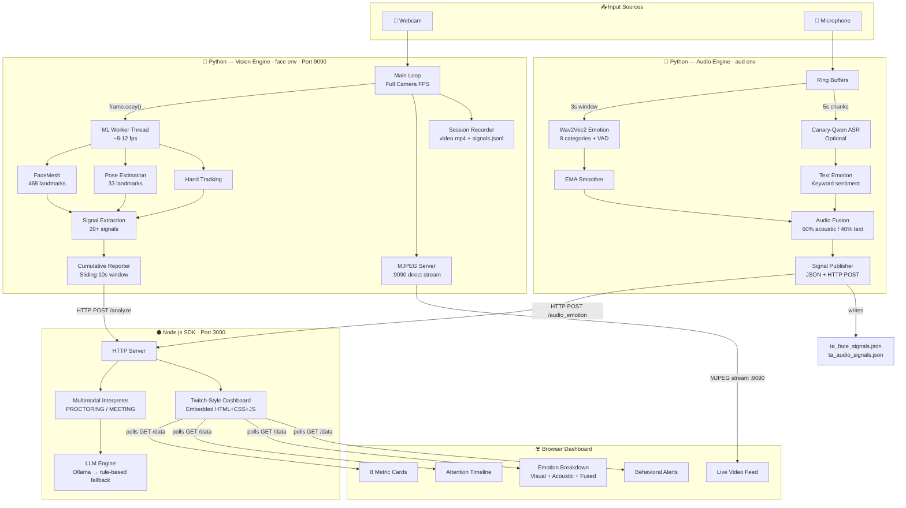
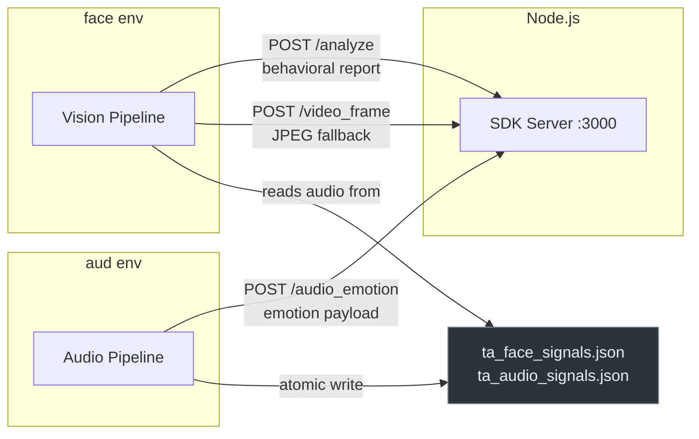

# Trusted Advisor AI — Behavioral Intelligence Platform

A real-time **multimodal behavioral intelligence platform** that fuses webcam vision with live audio emotion analysis. Extracts 20+ visual behavioral signals using MediaPipe and DeepFace, detects vocal emotion via Wav2Vec2, and optionally transcribes speech with NVIDIA Canary-Qwen-2.5B — all streamed to a Twitch-inspired dark-mode dashboard. Built for proctoring, meeting analysis, and engagement monitoring.

---

## 🏗️ System Architecture

```
Advisor-ai/
│
├── python-core/                    ← Python engines (Vision + Audio)
│   ├── main.py                     ← Vision pipeline: camera → signals → HTTP POST → MJPEG
│   ├── session_recorder.py         ← Auto-records video + signals per session
│   ├── training_exporter.py        ← CLI: export recordings → CSV / frames / sequences
│   │
│   ├── vision/                     ← Modular vision analyzers
│   │   ├── camera_pipeline.py      ← OOP camera capture + routing
│   │   ├── face_analyzer.py        ← FaceMesh signal extraction
│   │   └── pose_analyzer.py        ← Pose estimation signals
│   │
│   ├── aud/                        ← Audio emotion engine (Wav2Vec2 + Canary-Qwen)
│   │   ├── emo.py                  ← Core: models, inference, fusion, terminal dashboard
│   │   ├── emo_service.py          ← Headless service: JSON files + HTTP POST to Node.js
│   │   ├── __init__.py             ← Package exports
│   │   ├── download_models.py      ← Downloads Wav2Vec2 models from HuggingFace
│   │   ├── fix_weights.py          ← Model weight repair utilities
│   │   ├── fix_dim.py              ← Dimensional model config fix
│   │   ├── test_model.py           ← Model verification script
│   │   ├── local_emotion_models/   ← Downloaded Wav2Vec2 weights
│   │   ├── canary_model/           ← NVIDIA Canary-Qwen-2.5B weights
│   │   └── canary_audio/           ← Audio assets
│   │
│   └── analytics/                  ← Analytics modules
│       ├── aggregation_engine.py   ← Signal aggregation
│       ├── attention_engine.py     ← Attention scoring
│       ├── event_engine.py         ← Event detection
│       ├── event_tracker.py        ← Timestamped event logging
│       ├── report_generator.py     ← Cumulative report builder
│       └── temporal_buffer.py      ← Sliding window buffer
│
├── sdk/                            ← Node.js SDK (zero dependencies)
│   ├── src/
│   │   ├── index.js                ← Entry point + module exports
│   │   ├── server.js               ← Full HTTP backend (8 routes + dashboard)
│   │   ├── dashboard.js            ← Embedded Twitch-style UI (HTML+CSS+JS)
│   │   ├── interpreter.js          ← Multimodal behavioral interpreter v3
│   │   ├── llm_engine.js           ← Ollama LLM integration (rule-based fallback)
│   │   ├── session.js              ← Client session orchestrator
│   │   ├── signals.js              ← Reactive signal store
│   │   ├── attention.js            ← Attention timeline + focus streaks
│   │   ├── away.js                 ← Away detection + interval logging
│   │   ├── gestures.js             ← Session gesture counter
│   │   ├── api.js                  ← Native HTTP client (zero deps)
│   │   └── events.js               ← EventEmitter
│   ├── examples/
│   │   ├── full-server.js          ← Full server launch script
│   │   ├── basic-session.js        ← Client session demo
│   │   └── standalone-modules.js   ← Module-level demo
│   └── test/
│       └── run.js                  ← 54 unit tests (zero-dep framework)
│
├── recordings/                     ← Auto-generated session recordings
│   └── session_YYYY-MM-DD_HH-MM-SS_mmm/
│       ├── video.mp4               ← Raw webcam recording (no overlays)
│       ├── signals.jsonl           ← Timestamped behavioral signals (JSON Lines)
│       └── metadata.json           ← Session info (duration, frames, timestamps)
│
├── tests/
│   └── test_recording.py           ← 30 tests for recording + export pipeline
│
├── app.py                          ← Streamlit dashboard (alternative data-focused UI)
├── ta_face_signals.json            ← Shared signal file (vision + audio merged)
├── ta_audio_signals.json           ← Audio-only signal file
└── README.md
```

---

## 🔄 Workflow & Data Flow

### High-Level System Flow



### Thread Architecture

The pipeline uses a **decoupled multi-threaded architecture** across two separate Python environments:

| Component | Thread | Environment | Frequency | Purpose |
|-----------|--------|-------------|-----------|---------|
| **Main Loop** | Main | `face` | Camera FPS | Camera read → overlay → JPEG encode → MJPEG stream |
| **ML Worker** | Background | `face` | ~8-12 fps | FaceMesh + Pose + Hands → signal extraction |
| **MJPEG Server** | Daemon | `face` | On-demand | Direct HTTP stream to browser on port 9090 |
| **Video Poster** | Daemon | `face` | ~25 fps | HTTP POST JPEG frames to Node.js (fallback relay) |
| **Backend Poster** | Daemon | `face` | 2 Hz | HTTP POST behavioral reports to Node.js |
| **Acoustic Worker** | Daemon | `aud` | ~1 Hz | Wav2Vec2 emotion inference on 3s sliding window |
| **ASR Worker** | Daemon | `aud` | ~0.2 Hz | Canary-Qwen transcription on 5s chunks (optional) |
| **Signal Publisher** | Daemon | `aud` | 2 Hz | Writes audio emotion → JSON files + HTTP POST |

### Inter-Process Communication



> **Why two Python environments?** TensorFlow (required by MediaPipe/DeepFace) and PyTorch (required by Wav2Vec2) have conflicting NumPy version requirements. Separate conda environments prevent dependency conflicts. They communicate via shared JSON signal files and HTTP.

---

## 🚀 Setup & Installation

### Prerequisites

| Requirement | Version | Purpose |
|-------------|---------|---------|
| **Conda** (Miniconda or Anaconda) | Latest | Manages two isolated Python environments |
| **Python** | 3.9+ | Vision and audio engines |
| **Node.js** | 18+ | SDK server & dashboard |
| **Webcam** | — | Vision pipeline input |
| **Microphone** | — | Audio emotion pipeline input |
| **CUDA GPU** | Optional | Accelerates ML inference (~3-5x faster) |

### Step 1 — Create Conda Environments

You need **two separate** Python environments to avoid dependency conflicts:

```bash
# Create the vision environment
conda create -n face python=3.10 -y
conda activate face

# Create the audio environment
conda create -n aud python=3.10 -y
```

### Step 2 — Install Vision Dependencies (`face` env)

```bash
conda activate face
cd python-core

# Core vision packages
pip install opencv-python>=4.8.0 mediapipe>=0.10.0 numpy>=1.24.0

# DeepFace for facial emotion (auto-installs TensorFlow)
pip install deepface
```

### Step 3 — Install Audio Dependencies (`aud` env)

```bash
conda activate aud

# Core audio packages
pip install torch>=2.0.0 transformers>=4.30.0 safetensors>=0.3.0
pip install numpy sounddevice

# Download Wav2Vec2 emotion models (one-time, ~1.5 GB)
cd python-core/aud
python download_models.py
```

> **Optional — Canary-Qwen (live transcription + LLM summarization):**
> ```bash
> pip install "nemo_toolkit[asr] @ git+https://github.com/NVIDIA/NeMo.git"
> ```

### Step 4 — Node.js SDK

The SDK has **zero external dependencies** — nothing to install:

```bash
# Verify Node.js is available
node --version   # Should be 18+
```

### Conda Environment Summary

| Environment | Key Packages | ML Framework | Purpose |
|-------------|-------------|--------------|---------|
| `face` | OpenCV, MediaPipe, DeepFace | TensorFlow + NumPy 1.x | Vision pipeline (camera + 20+ behavioral signals) |
| `aud` | sounddevice, Transformers | PyTorch + NumPy 2.x | Audio emotion (Wav2Vec2 + optional Canary-Qwen) |

---

## ▶️ Running the System

### Full Multimodal Setup (Vision + Audio + Dashboard)

Open **three terminals** and run each in order:

```bash
# ╔═══════════════════════════════════════════════════╗
# ║  Terminal 1 — Node.js SDK Server                  ║
# ╚═══════════════════════════════════════════════════╝
node sdk/examples/full-server.js
# → Dashboard:     http://localhost:3000
# → API:           POST http://localhost:3000/analyze
# → Audio:         POST http://localhost:3000/audio_emotion
```

```bash
# ╔═══════════════════════════════════════════════════╗
# ║  Terminal 2 — Vision Pipeline (face env)          ║
# ╚═══════════════════════════════════════════════════╝
conda activate face
cd python-core
python main.py
# → MJPEG stream:  http://localhost:9090/video_feed
# → Posts reports to :3000/analyze every 0.5s
```

```bash
# ╔═══════════════════════════════════════════════════╗
# ║  Terminal 3 — Audio Emotion Service (aud env)     ║
# ╚═══════════════════════════════════════════════════╝
conda activate aud
cd python-core
python -m aud.emo_service
# → Posts emotion to :3000/audio_emotion every 0.5s
# → Writes to ta_face_signals.json + ta_audio_signals.json
```

### Vision Only (no audio)

```bash
# Terminal 1
node sdk/examples/full-server.js

# Terminal 2
conda activate face
cd python-core
python main.py
```

### Audio Only (standalone terminal dashboard)

```bash
conda activate aud
cd python-core/aud
python emo.py                 # Full terminal dashboard
python emo.py --no-canary     # Acoustic only, skip Canary-Qwen
python emo.py --list-devices  # List available microphones
python emo.py --device 2      # Use specific mic index
```

### Headless Audio Service (for integration)

```bash
conda activate aud
cd python-core
python -m aud.emo_service                             # Default settings
python -m aud.emo_service --no-canary                 # Acoustic only
python -m aud.emo_service --device 2                  # Specific mic
python -m aud.emo_service --backend-url http://host:3000  # Custom backend
```

### View the Dashboard

Open **http://localhost:3000** in your browser.

- Live video connects directly to Python's MJPEG server on port `9090` (lowest latency)
- Falls back to Node.js relay (`/video_feed`) automatically if direct stream is unavailable
- Audio emotion data appears automatically when `emo_service` is running
- All metrics, signals, and alerts update in real-time

**Alternative — Streamlit dashboard** (data-focused view):
```bash
streamlit run app.py
```

### Environment Variables

| Variable | Default | Description |
|----------|---------|-------------|
| `ADVISOR_CAMERA` | `0` | Camera device index |
| `ADVISOR_BACKEND_URL` | `http://localhost:3000/analyze` | Node.js backend URL |
| `ADVISOR_MODE` | `PROCTORING` | Operating mode (`PROCTORING` or `MEETING`) |
| `ADVISOR_MJPEG_PORT` | `9090` | Direct MJPEG stream port |

---

## 📦 Node.js SDK

The SDK packages the **entire backend** into a single importable module with **zero external dependencies**.

### Full Server

```js
const { createServer } = require("./sdk");
createServer({ port: 3000 }).start();
// Dashboard:      http://localhost:3000
// Python posts to: http://localhost:3000/analyze
// Audio posts to:  http://localhost:3000/audio_emotion
```

### Client Session (custom integrations)

```js
const { createSession } = require("./sdk");

const session = createSession({
  backendUrl: "http://localhost:3000",
  mode: "PROCTORING",
  pollInterval: 400,
});

session.on("update",       (data) => console.log(data));
session.on("focus_change", ({ from, to }) => console.log(`${from} → ${to}`));
session.on("away_end",     (log) => console.log(`Away ${log.durationSec}s`));
session.on("gesture",      (g) => console.log(`Gesture #${g.total}`));
session.on("alert",        (flags) => console.log(flags));

session.start();
const summary = session.getSummary();
```

### SDK Modules

| Module | Purpose |
|--------|---------|
| `createServer()` | Full HTTP backend + embedded dashboard |
| `createSession()` | Client orchestrator with real-time analytics |
| `Interpreter` | Multimodal behavioral analysis (PROCTORING / MEETING) |
| `LLMEngine` | Ollama-powered behavioral insights (rule-based fallback) |
| `ApiClient` | Native HTTP client for backend APIs |
| `AttentionTracker` | Rolling timeline, focus streaks, averages |
| `AwayTracker` | Timestamped away intervals (≥3s threshold) |
| `GestureCounter` | Cumulative session gesture count |
| `SignalStore` | Reactive signal state with face transition events |
| `EventEmitter` | Custom event system (13 event types) |

---

## 🎙️ Audio Emotion Engine

The audio pipeline runs **independently** from vision in its own conda environment.

### Tier 1 — Acoustic Emotion (Wav2Vec2, ~1s latency)

- **8 emotions**: Happy, Sad, Angry, Neutral, Fear, Disgust, Surprised, Calm
- **VAD dimensions**: Valence, Arousal, Dominance (continuous -1 to +1)
- **EMA temporal smoothing** + temperature-scaled softmax for stable predictions
- **Automatic mic gain calibration** on startup

### Tier 2 — Speech Understanding (Canary-Qwen-2.5B, ~5s latency, optional)

- **Live transcription**: Real-time speech-to-text subtitles
- **Text emotion analysis**: Keyword-based sentiment from transcript
- **Multimodal fusion**: 60% acoustic + 40% text emotion blending
- **Session summarization**: Press `S` for LLM-powered summary
- **Interactive Q&A**: Press `Q` to ask about the conversation

### Models Used

| Model | Source | Purpose |
|-------|--------|---------|
| `ehcalabres/wav2vec2-lg-xlsr-en-speech-emotion-recognition` | HuggingFace | Categorical emotion (8 classes) |
| `audeering/wav2vec2-large-robust-12-ft-emotion-msp-dim` | HuggingFace | Dimensional emotion (VAD) |
| `nvidia/canary-qwen-2.5b` | NVIDIA NeMo | Live transcription + summarization (optional) |

### Multimodal Inconsistency Detection

The SDK interpreter detects **cross-modal emotional conflicts** between face and voice:

| Pattern | Severity | Meaning |
|---------|----------|---------|
| 😊 Face + 😠 Voice | HIGH | **MASKED_ANGER** — suppressed frustration |
| 😊 Face + 😢 Voice | HIGH | **MASKED_SADNESS** — social masking |
| 😊 Face + 😨 Voice | HIGH | **NERVOUS_SMILE** — anxiety |
| 😐 Face + 😠 Voice | MEDIUM | **HIDDEN_FRUSTRATION** — internally frustrated |
| 😠 Face + 😊 Voice | MEDIUM | **CONFLICTED** — conflicting signals |
| 😢 Face + 😊 Voice | MEDIUM | **FORCED_POSITIVITY** — masking sadness |

---

## 🎥 Session Recording & Training Data

Sessions are **automatically recorded** to `recordings/` when the camera starts. No configuration needed.

### What Gets Recorded

| File | Contents |
|------|----------|
| `video.mp4` | Raw webcam frames (no overlays) — clean data for model training |
| `signals.jsonl` | One JSON object per frame with all 20+ behavioral signals |
| `metadata.json` | Session start/end time, duration, frame count, FPS |

### Training Data Export

```bash
# List all recorded sessions
python python-core/training_exporter.py --list

# Export as labeled CSV (one row per frame, 29 signal columns)
python python-core/training_exporter.py --session recordings/<session_dir> --format csv

# Extract video frames + per-frame label JSON files
python python-core/training_exporter.py --session <path> --format frames --sample-rate 5

# Export sliding-window sequences for temporal/RNN models
python python-core/training_exporter.py --session <path> --format sequences --window 30 --stride 10
```

### Export Formats

| Format | Use Case | Output |
|--------|----------|--------|
| `csv` | Tabular ML (sklearn, XGBoost) | Single CSV with 29 signal columns per frame |
| `frames` | Vision model fine-tuning | JPEG images + per-frame label JSON files |
| `sequences` | Temporal models (LSTM, Transformer) | Sliding-window JSON with aggregated labels |

### Programmatic Usage

```python
from session_recorder import SessionRecorder
from training_exporter import TrainingDataExporter

# Recording (automatic, but can be used standalone):
recorder = SessionRecorder(base_dir="my_recordings", fps=30)
recorder.start(frame_width=1280, frame_height=720)
recorder.write_frame(frame)      # raw BGR numpy array
recorder.write_signals(sig)      # behavioral signal dict
recorder.stop()

# Export for training:
exporter = TrainingDataExporter()
exporter.load_session("recordings/session_2026-03-31_13-45-00_123")
exporter.export_labeled_csv("training_data.csv")
exporter.export_frame_dataset("frames/", sample_rate=5)
exporter.export_sequence_windows("sequences.json", window_size=30, stride=10)
```

---

## ✨ Key Features

### Vision Engine (Python — `face` env)

- **20+ Behavioral Signals**: Gaze direction, eye contact score, blink rate, head pose, brow tension, lip state, smile detection (genuine/social/subtle), arm position, shoulder alignment, neck orientation, sitting posture
- **Emotion Detection**: Real-time facial emotion classification via DeepFace
- **Gesture Tracking**: Session-based cumulative hand gesture counting
- **Event Tracking**: Timestamped behavioral events with precise start/end times and durations
- **Auto-Recording**: Sessions automatically recorded (video + signals) when camera starts
- **Multi-Threaded Pipeline**: ML inference in background thread; video streams at full camera FPS
- **Direct MJPEG Server**: Built-in HTTP server on port 9090 for zero-latency browser streaming
- **Headless Pipeline**: Runs without GUI, streams JPEG frames to Node.js backend

### Dashboard (Twitch-Inspired Dark UI)

- **Live Video Feed**: Direct MJPEG stream from Python (:9090) with Node.js fallback
- **Attention Timeline**: Real-time Chart.js line graph of attention score
- **Live Timers**: Session uptime and away time chronometers
- **Away Interval Log**: Timestamped records of every absence ≥ 3 seconds
- **Focus Level Badge**: Dynamic gradient-text focus level indicator
- **8 Metric Cards**: Engagement, tension, eye contact, posture, gaze, gestures, head pose, blink rate
- **Signal Badges**: Real-time facial signal status (smile, brow, lip, nodding, head shake)
- **Emotion Breakdown**: Horizontal bar chart (visual + acoustic + fused)
- **Audio Emotion Panel**: Acoustic scores, VAD dimensions, and live transcript
- **Behavior Analysis**: Contextual engagement and tension alerts

### SDK (Node.js — Zero Dependencies)

- **Zero Dependencies**: Uses only native Node.js `http` module
- **Embedded Dashboard**: HTML + CSS + JS served from memory (no static files)
- **54 Unit Tests**: Full test suite with zero external test frameworks
- **Event-Driven**: 13 event types for reactive integrations
- **Dual Mode**: PROCTORING (suspicion levels) and MEETING (engagement levels)
- **Multimodal Interpreter**: Cross-modal inconsistency detection
- **LLM Integration**: Ollama-powered behavioral insights with rule-based fallback
- **Recording API**: `GET /recordings` to list all sessions

---

## 🔌 API Reference

| Method | Route | Port | Description |
|--------|-------|------|-------------|
| `POST` | `/analyze` | 3000 | Receive behavioral report from vision pipeline, return interpretation |
| `POST` | `/audio_emotion` | 3000 | Receive audio emotion payload from `emo_service.py` |
| `GET`  | `/data` | 3000 | Latest report + audio emotion for dashboard polling |
| `GET`  | `/audio_data` | 3000 | Latest audio emotion data only |
| `POST` | `/video_frame` | 3000 | Receive JPEG frame from Python pipeline (relay fallback) |
| `GET`  | `/video_feed` | 3000 | MJPEG live stream via Node.js relay (fallback) |
| `GET`  | `/video_feed` | 9090 | MJPEG live stream direct from Python (primary, lowest latency) |
| `GET`  | `/recordings` | 3000 | List all recorded sessions with metadata |
| `GET`  | `/` | 3000 | Twitch-style dashboard UI |

---

## 🧪 Testing

```bash
# SDK unit tests (54 tests, zero-dep framework)
cd sdk
npm test

# Recording + export pipeline tests (30 tests)
python tests/test_recording.py

# Module demos (no backend needed)
node sdk/examples/standalone-modules.js

# Audio emotion model verification
conda activate aud
cd python-core/aud
python test_model.py
```

---

## 📄 License

MIT
