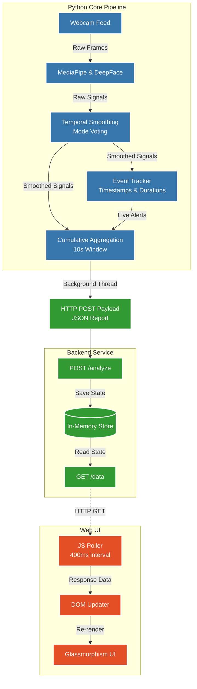

# Trusted Advisor AI — Behavioral Intelligence Platform

Trusted Advisor AI is a real-time behavioral intelligence platform that captures webcam frames, processes them for behavioral signals, tracks events with precise timestamps and durations, and streams structured data to a sleek, dark-themed web dashboard for live monitoring and proctoring.

---

## 🏗️ System Architecture

The project is divided into three primary components:

1. **Python Vision & Analytics Engine (`python-core/`)**
   - **Capture**: Reads webcam feed using OpenCV.
   - **Signal Extraction**: Uses MediaPipe (FaceMesh, Pose, Hands) and DeepFace (Emotion) to extract raw physical signals (gaze, blinks, posture, gestures, tension).
   - **Temporal Smoothing**: Analyzes recent frame history (e.g., 5-frame rolling window) to stabilize noisy signals (like shoulder alignment or neck position).
   - **Event Tracking**: Monitors state changes (e.g., center gaze to looking away) and records timestamps and active durations for behavioral events.
   - **Reporting**: Aggregates signals over a sliding window (e.g., 10 seconds) to calculate overall "Attention Scores" and metrics.
   - **Networking**: Pushes structured JSON reports to the backend via non-blocking HTTP requests (`urllib`) at ~2-3 Hz.

2. **Node.js Backend (`backend/`)**
   - **In-Memory Store**: Receives HTTP POST requests from the Python engine and stores the latest behavioral state.
   - **API Provider**: Exposes a `GET /data` endpoint for the dashboard to poll.
   - **Static Server**: Serves the frontend web dashboard assets (HTML, CSS, JS).

3. **Web Dashboard (`backend/public/`)**
   - **Live UI**: A modern, glassmorphism-styled dashboard built with vanilla HTML/CSS/JS.
   - **Polling Strategy**: Fetches from `/data` every 400ms to ensure smooth updates without overwhelming the browser.
   - **Visualizations**: Displays dynamic attention rings, live alerts with pulsing indicators, real-time metrics, and a chronological look-away episode timeline.

---

## 🔄 Working Flow Diagram



---

## 🚀 Setup & Execution

### Prerequisites
- Python 3.9+
- Node.js 18+
- Webcam

### 1. Install Dependencies
```bash
# Python
cd python-core
pip install -r requirements.txt

# Node.js
cd backend
npm install
```

### 2. Run the System

You need two terminal windows to run the system.

**Terminal 1 (Backend Server):**
```bash
cd backend
node server.js
```
*(Runs on `http://localhost:3000`)*

**Terminal 2 (Python Engine):**
```bash
cd python-core
python main.py
```
*(Opens the OpenCV preview window; press `q` in the window to stop)*

### 3. View the Dashboard
Open your browser and navigate to:
**`http://localhost:3000`**

---

## ✨ Key Features

- **Live Look-Away Tracking**: Precisely measures exact durations of "Look Away" episodes with start and end timestamps.
- **Advanced Posture Intelligence (V6)**: Analyzes shoulder alignment, energy (dropped/active), neck position (forward/tilted), and sitting posture (upright/slouched/shifting).
- **Responsive Dark Theme UI**: Beautiful, distraction-free aesthetic with color-coded alerts and dynamic progress rings.
- **Zero-Block Processing**: Multi-threaded architecture ensures CPU-heavy AI operations don't freeze the camera feed or drop network packets.
