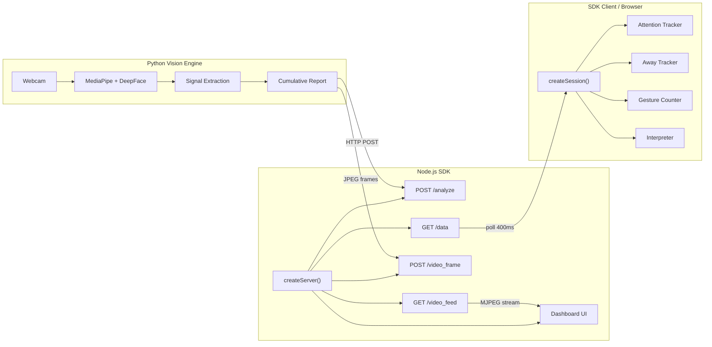

# Trusted Advisor AI — Behavioral Intelligence Platform

A real-time behavioral intelligence platform that captures webcam frames, extracts 20+ behavioral signals using MediaPipe and DeepFace, and streams live analytics to a Twitch-inspired dark-mode dashboard. Built for proctoring, meeting analysis, and engagement monitoring.

---

## 🏗️ System Architecture

```
Advisor-ai/
├── python-core/          ← Vision & analytics engine (MediaPipe, DeepFace)
│   └── main.py           ← Headless pipeline: camera → signals → HTTP POST
├── backend/              ← Express server (legacy, replaced by SDK)
│   ├── server.js
│   └── public/           ← Dashboard assets (HTML, CSS, JS)
├── sdk/                  ← ★ Node.js SDK — the entire project as a package
│   ├── src/
│   │   ├── index.js      ← Entry point
│   │   ├── server.js     ← Full HTTP server (replaces backend/server.js)
│   │   ├── dashboard.js  ← Embedded dashboard (replaces backend/public/)
│   │   ├── session.js    ← Session orchestrator
│   │   ├── api.js        ← HTTP client (zero deps)
│   │   ├── signals.js    ← Reactive signal store
│   │   ├── attention.js  ← Attention timeline & focus streaks
│   │   ├── away.js       ← Away detection & interval logging
│   │   ├── gestures.js   ← Session gesture counter
│   │   ├── interpreter.js← Behavioral interpretation engine
│   │   └── events.js     ← EventEmitter
│   ├── examples/
│   │   ├── full-server.js      ← One-file backend replacement
│   │   ├── basic-session.js    ← Live session monitoring
│   │   └── standalone-modules.js
│   └── test/
│       └── run.js        ← 54 unit tests, zero dependencies
└── README.md
```

### Data Flow



---

## 🚀 Setup & Execution

### Prerequisites
- **Python 3.9+** with OpenCV, MediaPipe, DeepFace, NumPy
- **Node.js 18+**
- Webcam

### 1. Install Dependencies

```bash
# Python
cd python-core
pip install -r requirements.txt

# Node.js backend (legacy)
cd backend
npm install

# SDK has zero dependencies — nothing to install
```

### 2. Run the System

**Option A — Using the SDK (recommended):**
```bash
# Terminal 1: Start the SDK server
node sdk/examples/full-server.js

# Terminal 2: Start the Python pipeline
cd python-core
python main.py
```

**Option B — Using the legacy backend:**
```bash
# Terminal 1: Start Express backend
cd backend
node server.js

# Terminal 2: Start the Python pipeline
cd python-core
python main.py
```

### 3. View the Dashboard
Open **http://localhost:3000** in your browser.

---

## 📦 Node.js SDK

The SDK packages the **entire project** into a single importable module with zero external dependencies.

### Full Server (replaces `backend/server.js`)

```js
const { createServer } = require("./sdk");
createServer({ port: 3000 }).start();
// Dashboard: http://localhost:3000
// Python posts to: http://localhost:3000/analyze
```

### Client Session (for custom integrations)

```js
const { createSession } = require("./sdk");

const session = createSession({
  backendUrl: "http://localhost:3000",
  mode: "PROCTORING",
  pollInterval: 400,
});

session.on("update",       (data) => console.log(data));
session.on("focus_change", ({ from, to }) => console.log(`${from} → ${to}`));
session.on("away_end",     (log) => console.log(`Away ${log.durationSec}s`));
session.on("gesture",      (g) => console.log(`Gesture #${g.total}`));
session.on("alert",        (flags) => console.log(flags));

session.start();

// Get full summary at any time
const summary = session.getSummary();
```

### SDK Modules

| Module | Purpose |
|--------|---------|
| `createServer()` | Full HTTP backend + embedded dashboard |
| `createSession()` | Client orchestrator with real-time analytics |
| `ApiClient` | Native HTTP client for backend APIs |
| `AttentionTracker` | Rolling timeline, focus streaks, averages |
| `AwayTracker` | Timestamped away intervals (≥3s threshold) |
| `GestureCounter` | Cumulative session gesture count |
| `Interpreter` | PROCTORING / MEETING behavioral analysis |
| `SignalStore` | Reactive signal state with face transition events |

---

## ✨ Key Features

### Vision Engine (Python)
- **20+ Behavioral Signals**: Gaze direction, eye contact score, blink rate, head pose, brow tension, lip state, smile detection (genuine/social/subtle), arm position, shoulder alignment, neck orientation, sitting posture
- **Emotion Detection**: Real-time facial emotion classification via DeepFace
- **Gesture Tracking**: Session-based cumulative hand gesture counting
- **Event Tracking**: Timestamped behavioral events with precise start/end times and durations
- **Headless Pipeline**: Runs without GUI, streams JPEG frames to Node.js backend

### Dashboard (Twitch-Inspired UI)
- **Live Video Feed**: MJPEG stream embedded directly in the dashboard
- **Attention Timeline**: Real-time Chart.js line graph of attention score
- **Live Timers**: Session uptime and away time chronometers
- **Away Interval Log**: Timestamped records of every absence ≥3 seconds
- **Focus Level Badge**: Dynamic gradient-text focus level indicator
- **8 Metric Cards**: Engagement, tension, eye contact, posture, gaze, gestures, head pose, blink rate
- **Signal Badges**: Real-time facial signal status (smile, brow, lip, nodding, head shake)
- **Emotion Breakdown**: Horizontal bar chart of emotion distribution
- **Behavior Analysis**: Contextual engagement and tension alerts

### SDK (Node.js)
- **Zero Dependencies**: Uses only native Node.js `http` module
- **Embedded Dashboard**: HTML + CSS + JS served from memory (no static files)
- **54 Unit Tests**: Full test suite with zero external test frameworks
- **Event-Driven**: 13 event types for reactive integrations
- **Dual Mode**: PROCTORING (suspicion levels) and MEETING (engagement levels)

---

## 🔌 API Reference

| Method | Route | Description |
|--------|-------|-------------|
| `POST` | `/analyze` | Receive behavioral report, return interpretation |
| `GET`  | `/data` | Latest report + signals for dashboard polling |
| `POST` | `/video_frame` | Receive JPEG frame from Python pipeline |
| `GET`  | `/video_feed` | MJPEG live stream for browser embed |
| `GET`  | `/` | Twitch-style dashboard UI |

---

## 🧪 Testing

```bash
cd sdk
npm test              # 54 tests, 0 dependencies
node examples/standalone-modules.js  # Module demos (no backend needed)
```
